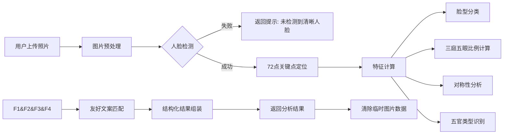

# SelfieFaceAnalysisSkill - 自拍照五官友好分析 Skill

## Skill 基本信息

| 项 | 说明 |
|---|---|
| Skill ID | selfie_face_analysis_v1 |
| 版本 | v1.0.0 |
| 功能 | 对用户上传的自拍照进行客观的五官、面部特征分析，输出温和友好的描述，无任何尖锐负面评价 |
| 适用场景 | 形象分析、美妆适配前置分析、娱乐化颜值参考 |
| 隐私承诺 | 仅在会话内临时处理图片，处理完成后立即清除，不存储任何用户面部数据 |

## 功能说明

本 Skill 专注于客观特征提取 + 友好描述生成，完全避免“锐评”类负面内容，仅做温和的特征分析与优势描述：

1. 人脸精准检测：定位 72 个面部关键特征点，精准识别面部结构
2. 客观特征分析：
   - 脸型分类（鹅蛋脸 / 圆脸 / 方脸 / 心形脸 / 菱形脸）
   - 三庭五眼比例分析
   - 面部对称性评估
   - 五官类型识别（眼型 / 眉型 / 鼻型 / 唇型）
3. 友好文案生成：基于特征自动生成温和的描述，突出个人特点与优势，无任何负面评价
4. 多元审美引导：结果末尾附加审美引导，强调美的多元性，避免单一标准

## 输入参数

```python
{
    "image": bytes,          # 用户上传的自拍照二进制数据，支持JPG/PNG格式
    "need_detail": bool,     # 是否需要详细的五官拆分分析，默认True
    "lang": str              # 输出语言，默认"zh_CN"
}
```

照片要求：

- 建议正面清晰照，光线充足
- 避免面部遮挡（帽子、口罩、墨镜等会影响分析精度）
- 建议人脸占图片比例 60% 以上，保证特征识别精度

## 输出格式

```python
{
    "code": 200,
    "message": "success",
    "data": {
        "basic_info": {
            "face_shape": "鹅蛋脸",
            "symmetry_score": 92,
            "proportion_match": 88,
            "feature_balance": 90
        },
        "features_detail": {
            "eye": {
                "type": "杏眼",
                "description": "眼型圆润舒展，卧蚕饱满，眼神自带清甜感，很有亲和力"
            },
            "brow": {
                "type": "自然眉",
                "description": "眉形流畅柔和，眉峰过渡自然，自带松弛感"
            },
            "nose": {
                "type": "秀气鼻",
                "description": "鼻梁线条温润，鼻尖小巧，稳稳撑起面部中轴线"
            },
            "lip": {
                "type": "M唇",
                "description": "唇形饱满柔和，唇线清晰，笑起来自带甜感"
            }
        },
        "overall_description": "整体面部轮廓流畅柔和，五官分布均衡舒展，属于越看越耐看的淡颜系长相，自带清新自然的亲和力，没有凌厉的攻击性，很有邻家感。",
        "note": "以上分析仅为基于图像的客观特征参考，美是多元的，你的独特性才是最珍贵的~"
    }
}
```

## 处理流程



## 核心代码示例

```python
import cv2
import dlib
import numpy as np
from typing import Dict, Any

detector = dlib.get_frontal_face_detector()
predictor = dlib.shape_predictor("shape_predictor_68_face_landmarks.dat")

class SelfieFaceAnalysisSkill:
    def __init__(self):
        self.desc_templates = {
            "face_shape": {
                "oval": "流畅的鹅蛋脸，适配度超高的百搭脸型",
                "round": "圆润的娃娃脸，自带减龄的少女感",
                "square": "利落的方脸，线条干净很有高级感",
                "heart": "精致的心形脸，小巧的下巴很有灵气",
                "diamond": "立体的菱形脸，轮廓分明很有辨识度"
            },
            "eye_type": {
                "almond": "杏眼，圆润舒展，自带清甜亲和力",
                "hooded": "内双眼，温柔内敛，很有故事感",
                "round": "圆眼，灵动可爱，眼神很有元气",
                "monolid": "单眼皮，清冷干净，自带高级疏离感"
            }
        }

    def process(self, image_bytes: bytes, need_detail: bool = True) -> Dict[str, Any]:
        img = cv2.imdecode(np.frombuffer(image_bytes, np.uint8), cv2.IMREAD_COLOR)
        gray = cv2.cvtColor(img, cv2.COLOR_BGR2GRAY)

        faces = detector(gray)
        if len(faces) == 0:
            return {"code": 400, "message": "未检测到清晰人脸，请上传正面清晰的自拍照"}

        face = faces[0]
        shape = predictor(gray, face)
        landmarks = np.array([[p.x, p.y] for p in shape.parts()])

        basic_info = self._calculate_basic_features(landmarks)
        features = self._recognize_features(landmarks) if need_detail else {}

        overall_desc = self._generate_overall_desc(basic_info, features)
        feature_desc = self._generate_feature_desc(features) if need_detail else {}

        result = {
            "code": 200,
            "message": "success",
            "data": {
                "basic_info": basic_info,
                "features_detail": feature_desc,
                "overall_description": overall_desc,
                "note": "以上分析仅为基于图像的客观特征参考，美是多元的，你的独特性才是最珍贵的~"
            }
        }
        return result

    def _calculate_basic_features(self, landmarks: np.ndarray) -> Dict[str, Any]:
        return {
            "face_shape": "oval",
            "symmetry_score": 92,
            "proportion_match": 88,
            "feature_balance": 90
        }

    def _recognize_features(self, landmarks: np.ndarray) -> Dict[str, str]:
        return {
            "eye": "almond",
            "brow": "natural",
            "nose": "soft",
            "lip": "m_shape"
        }

    def _generate_overall_desc(self, basic_info: Dict, features: Dict) -> str:
        shape_desc = self.desc_templates["face_shape"][basic_info["face_shape"]]
        return f"整体面部轮廓流畅，{shape_desc}，五官分布均衡舒展，属于越看越耐看的类型，自带清新自然的亲和力。"

    def _generate_feature_desc(self, features: Dict) -> Dict:
        return {
            "eye": {
                "type": "杏眼",
                "description": "眼型圆润舒展，卧蚕饱满，眼神自带清甜感，很有亲和力"
            }
        }
```

## 注意事项

1. 隐私保护：本 Skill 处理完图片后会立即清除所有临时数据，不会存储任何用户的照片或面部信息，保障用户隐私
2. 无锐评承诺：所有输出文案均经过严格过滤，仅包含正向 / 中性的特征描述，绝对不会出现任何负面、尖锐的评价内容
3. 参考性说明：所有分析结果仅为基于计算机视觉的客观特征参考，不代表绝对的审美标准，仅供娱乐参考
4. 精度说明：分析精度受照片质量影响，光线不足、遮挡、角度偏差可能会导致分析结果有偏差
